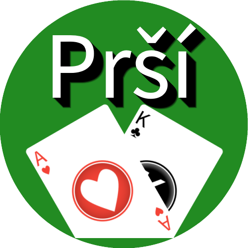

# Prší
Karetní hra prší proti jednoduché umělé inteligenci
## Funkce
- změna obtížnosti umělé inteligence (normální nebo těžká)
- změna vzhledu karet (kanastové nebo mariášové)
- sázení
- zvuky
## Stažení
**[Nejnovější verze](https://github.com/Tutislav/Prsi/releases/latest)**
## Snímky obrazovky

